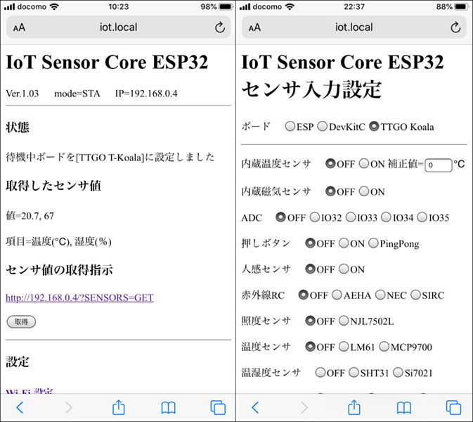

# IoT Sensor Core ESP32 by Wataru KUNINO  

ESP32-WROOM-32モジュール用の IoT センサ機器向けプログラムです。  

## 特長

- スマートフォンやパソコンから設定を行うことが出来ます。  
- ディープスリープに対応しています。  
- 内蔵の温度センサ、AD変換器に接続したセンサなどの読み値を送信します。  
- 単2型アルカリ乾電池2本で1年以上の動作が可能です(注意点参照)。  

## 対応デバイス(Ver. 1.08～)

* ESP32マイコン内蔵温度センサ(発熱による温度上昇の影響を受けます)  
* ESP32マイコン内蔵磁気センサ：磁石を近づけたときに数値が変化します  
* ESP32マイコン内蔵ADコンバータ：電圧を取得します(約0～3V)  
* 押しボタン：BOOTボタンまたはIO0に接続した押しボタンで状態を取得します
* 人感センサ：Nanyang SB412A などに対応
* 赤外線リモコン受信：赤外線リモコン信号を受信すると、そのコードを取得します  
* 照度センサ：新日本無線 NJL7502L に対応
* 温度センサ：TI LM61 や Microchip MCP9700 に対応
* 温湿度センサ：Sensirion SHT31や Silicon Labs Si7021、HTU21D(Si7021を選択)、ASONG AM2320、AM2302 (DHT22) 、DHT11 などに対応
* 環境センサ：Bosch BME280 BMP280に対応
* 加速度センサ：Analog Devices ADXL345に対応
* LED：汎用品に対応
* LCD：I2C液晶 AQM0802A などに対応

## 必要なハードウェア

* ESP32マイコン開発ボード（Espressif ESP32 DevKitC, TTGO Koalaなど）  
* パソコン(Windows 10)または Raspberry Pi [^1]  
* ボードを接続するためのUSBケーブル [^2]  
* インターネット接続環境（要Wi-Fiアクセスポイント）  

[^1]: IoT Sensor Core ファームウェアを書き込むために使用します。書き込み済の IoT Sensor Core をお持ちの場合は不要です。  
[^2]: ESP32マイコンへの電源供給とファームウェアの書き込みに使用します。パソコンや Raspberry Pi をお持ちでない場合は、USB出力のACアダプタが必要です。  

## インストール方法 【Windowsを使用する場合】

ファームウェアの書き込みツール Flash Download Tools を使用して、ESP32-WROOM-32に書き込むことができます。  
詳しくは、[インストール説明書](https://raw.githubusercontent.com/bokunimowakaru/sens/master/README.pdf)をご覧ください。  

		インストール説明書(PDF)
		https://raw.githubusercontent.com/bokunimowakaru/sens/master/README.pdf

## インストール方法 【Rasberry Piを使用する場合】

IoT Sensor Core を ESP32-WROOM-32に書き込むには、bash、gitツール、pythonが動作する環境（Raspberry Pi、Windows 10 + Cygwinで動作確認済み）が必要です。

* 下記のコマンドで IoT Sensor Core をダウンロードしてください。  

		git clone https://github.com/bokunimowakaru/sens

* ESP32開発ボードを パソコンまたは Raspberry Pi の USB へ接続してください。  

* 下記のコマンドでUSBシリアルのデバイスPath(/dev/ttyUSB*、「*」は数字)を確認してください。表示されないときはUSB接続をやり直してください。  

		ls -l /dev/serial/by-id/

* 下記のコマンドを入力するとESP32へ書き込むことが出来ます 。複数のUSBシリアル変換器を使用している場合は、第1引数にシリアルポート（/dev/ttyUSB0や/dev/ttyS2など）を追加してください。  

		cd ~/sens/target  
		./iot-sensor-core-esp32.sh  

## 使い方[1] ブラウザでアクセスする

本機を起動すると、無線LANアクセスポイント(AP)として動作します。スマートフォンのWi-Fi設定から「iot-core-esp32」を探して、接続してください。パスワードは「password」です。

	本機AP接続情報
		SSID = iot-core-esp32  
		PASS = password  

接続後、インターネットブラウザのアドレス入力欄に[http://iot.local/](http://iot.local/)または[http://192.168.254.1/](http://192.168.254.1/)を入力すると、設定画面が表示されます。

	アクセス用URL  
		mDNS対応OS (iOS, macOS, Windows 10)  
		http://iot.local/  
		非対応のOS (Android, Raspberry Pi, Linux)  
		http://192.168.254.1/  

APモードまたはAP+STAモードで動作しているときは、本機APへ接続した機器（スマートフォンやパソコン）から設定を行ってください。STAモードの時はLANへ接続した機器から設定を行ってください。  

mDNS非対応のOS（Androidなど）を使用する場合、「[http://iot.local/](iot.local)」の部分をIPアドレスで指定してください。また、再起動時など、自動的に画面が復帰しません。ブックマークに「[192.168.254.1](http://192.168.254.1/)」を登録しておき、その都度、アクセスしてください。  

教室などで、複数の Wi-Fi APを使用する場合は、「Wi-Fi設定」の「Wi-Fi AP 設定」の「MAC付SSID」を[ON]にしてください。Wi-Fi AP の SSID に MAC アドレスの下4桁が自動的に付与されます。  

## 使い方[2] センサ設定

「センサ設定」画面を使って、使用するESP32開発ボードの選択と、本機に接続するセンサの設定を行ってください。

	センサ設定  
		http://iot.local/sensors  
		または  
		http://192.168.254.1/sensors  

## 使い方[3] ピン配列表

「ピン配列表」画面で、センサの接続先を確認してください。

	ピン配列の確認  
		http://iot.local/pinout  
		または  
		http://192.168.254.1/pinout  

接続先を確認したら、電源メニュー内の[GPIO 再起動]を実行してください。  
再起動時にWi-Fiが切れると、スマートフォンが他のWi-Fiアクセスポイントに接続する場合があります。  
その都度、Wi-Fiアクセスポイントをiot-core-esp32に設定するか、不要なWi-Fiアクセスポイントを止める、スマートフォンから削除するといった対策を行ってください。  

## Wi-Fi設定の保存機能

Wi-Fi設定の「Wi-Fi再起動」の[保存]にタッチすると、現在のWi-Fi設定をSPIフラッシュメモリに書き込みます。ボード設定やセンサ設定、Ambientなどの設定は保存されません。保存したWi-Fi設定を元に戻すには、SPIFFSの初期化を行ってください。BOOTボタンを押し、離し、すぐにIO0をショートすると初期化することが出来ます。本機を廃棄するときは、SPIフラッシュの内容を消去してください。

## コンパイル方法（通常はコンパイル不要）

Arduino IDEを使って、開発途上版を自分でコンパイルして使用することが出来ます。[ファイル]メニューの[環境設定]を選択し、「追加のボードマネージャのURL」に下記を追加してください。すでに他のURLが書かれている場合は、末尾にカンマ区切りで追加してください。  

	Arduino開発環境（通常は不要）  
		https://dl.espressif.com/dl/package_esp32_index.json  

[ツール]の[ボード]メニューの[ボードマネージャ]から「esp32 by Espressif Systems」を検索で探し、[インストール]してください。  
また、インストール後に「ESP32 Dev Module」を選択してください。

	ESP32開発環境（通常は不要）  
		esp32 by Espressif Systems  
	ボード選択  
		ESP32 Dev Module  
	推奨コンパイル・オプション  
		ソースコードiot-sensor-core-esp32.inoに記載

「iot-sensor-core-esp32.ino」がメインのファイルです。PCのArduinoフォルダ内にiot-sensor-core-esp32フォルダ内を作成し、iot-sensor-core-esp32.inoを含むすべての.inoファイルをコピーし、Arduino IDEで開き、画面情報の右矢印「⇒」をクリックすると、コンパイルと、USB接続したESP32モジュールへのファームウェアを書き込みが実行されます。

--------------------------------------------------------------------------------

## 注意点

### 測定値に関する注意点
* 本機から得られた測定値は目安です。測定結果や根拠データとして使用することは出来ません。  
* 内蔵温度センサは個体差が大きいので補正が必要です。実際の室温との差を補正値へ入力してください。室温が25℃で、表示が15℃の時は、差の10℃を入力してください。  
* 本機の温度上昇とともに内蔵温度センサの測定値は上昇します。30分以上経過してから補正することで、精度を高めることができます。  

### 乾電池動作に関する注意点
* 起動時はAPモードで動作します。STAモードに比べて、起動時に多くの電力を要するので、新品の単2アルカリ乾電池を使用してください。  
* APモードでは丸1日程度しか動作しません。また、電池残量を残したまま動作しなくなります。
* 使えなくなった電池を廃棄(リサイクル)するときは、必ずマイナス極をビニールテープなどで絶縁してください。  
* 長期間の駆動を行うには、[Wi-Fi 設定]の[動作モード]をSTAモードに設定し、[スリープ設定]を[15分]～[60分]にする必要があります。また、条件によって動作期間が大きく変化します。  

### センサデバイス接続時の注意点
* デバイスを接続するときは、(なるべく)電源を切るか、スリープ状態にしてください。

### 人感センサの電源に関する注意点
* 間欠動作させるときは、人感センサの電源を3.3Vに接続してください。スリープ時はGPIOからの電源供給が途絶えます。

### 温度センサの補正について
* 内蔵温度センサやLM61、MCP9700を使用するときは温度値の補正が必要です。実測とのずれを「補正値」の入力欄へ記入してください。

### セキュリティに関する注意点
実験用に開発したソフトウェアにつき、一例として以下のセキュリティについて注意して使用してください。
* APモード([AP+STA]モードを含む)の動作中は、「使い方」に記したSSID(iot-core-esp32)とパスワード(password)による本機へのWi-Fi接続が可能です。これらは一般公開しているので、本機のWi-Fiネットワークへ侵入したり、データ傍受することが容易な状態です。  
* 本機のAPモード([AP+STA]モードを含む)によるWi-Fiネットワークへ侵入された場合、通信内容が傍受される可能性があります。本機を[STA]モードに設定し、インターネットプロバイダから提供されている(一般的な)ルータ機能付きのWi-Fiアクセスポイントの暗号化通信機能を用いることで、侵入されにくくなります。  
* インターネットブラウザから入力したSTAモード用のSSIDとパスワードは、暗号化せずに本機へ送信されます。本機のWi-Fiネットワークへの侵入があった場合、STAモード用のSSIDとパスワードが傍受される可能性があります。APモードでの利用頻度を減らすことで、傍受されるリスクを低減することが出来ます。  
* (参考情報) ソースコードiot-sensor-core-esp32.ino中の「SSID_AP」を未使用のSSIDに変更し、「PASS_AP」に8文字以上のパスワードを設定することで、本機のWi-Fiネットワークへの侵入リスクや傍受されるリスクを低減することも出来ます(本機を廃棄するときのことも考慮し、本機専用のSSIDとパスワードを設定して下さい)。  
* インターネットブラウザによっては、パスワード保存機能やパスワード自動入力機能、キャッシュ(戻るボタンや更新ボタンを含む)により、ブラウザに保持されたSSIDやパスワードを本機以外に送信してしまう場合があります。接続先(iot.local)が正しいかどうかを確認するなど、他のサイトへの誤送信に注意してください。  
* センサ値データの送信に暗号化されていないUDPを用いているので、ネットワークへの侵入があった場合に傍受される可能性があります。UDP送信設定を[OFF]にすることで防止することが出来ます。  
* Ambientへデータ送信するときのインターネット通信に暗号化されていないHTTPを用いているので、公衆Wi-Fiアクセスポイントを使用しているときなどに、データを傍受される可能性があります。Ambientへの送信を[OFF]にすることで防止することが出来ます。  
* 当方が作成したソフトウェアや、Espressif Systems社の提供するハードウェアやソフトウェア、Arduino IDEに含まれるソフトウェア、Wi-FiやBluetooth規格などに脆弱性が潜伏している可能性も考えられます。なるべく最新のものを使用するとともに、提供元からの更新が1年以上(目安)にわたって実施されていない場合は、使用の中止を検討してください。  

## 初期設定値について

* 電源を切る、またはESP32開発ボード上のENボタンを押すと、全ての設定が初期値に戻ります（Wi-Fi設定で保存した項目を除く）。
* 初期値を変更したい場合は、本フォルダ内のソースコードiot-sensor-core-esp32.inoのRTC_DATA_ATTRから始まる行を変更し、Arduino IDEでコンパイルしてください。例えば、Wi-Fi STA接続先のSSIDはSSID_STA、パスワードはPASS_STAで設定することが出来ます。
* 本機を廃棄するときは、SPIフラッシュの内容を消去してください。ツール esptool.py を使用し、「esptool.py erase_flash」を実行すると消去することが出来ます。

## リリース履歴

		2019/01/26 α版の公開  
		2019/04/14 α２版の公開  
		2019/06/25 β版の公開（書籍投稿用）  
		2019/11/25 Ver. 1.00 正式版リリース（エレキジャックIoT用）  
		2019/12/06 Ver. 1.03 湿度センサ3種追加、バグ修正 
		2020/01/13 Ver. 1.05 SSIDにMAC下4桁を追加する機能  
		（教室などで複数のIoT SensorCoreを利用する場合を想定）  
		2023/07/10 Ver. 1.08 HTU21D(Si7021を選択)に暫定対応  
  		（[参考情報・温湿度センサ Si7021 と HTU21D の見分け方](https://bokunimo.net/blog/esp/3797/)）

## サポートサイト

* 関連情報のウェブサイト：<https://bokunimo.net/ambient/>  

--------------------------------------------------------------------------------

## IoT Sensor Core の販売について

* 当方が作成した IoT Sensor Core を組み込んだ製品を販売する場合は、下記のライセンスへの同意が必要です。  
* 販売を開始した時点で同意したものといたします。  
* 販売によって、いかなる被害が生じた場合であっても、当方は、一切、補償いたしません。  

## ライセンス(全般)

* 各ソースリストならびに各フォルダ内のファイルに記載の通りです。  
* 原則として、使用・変更・配布は可能ですが、権利表示を残してください。  
* ライセンスが明記されていないファイルについても、同様です。  
* targetフォルダ内の各binファイルについては、配布を禁止します。  
* 当方が作成した（もしくは追加した）ソフトウェア以外については、作成者の権利を優先します。  
* 提供情報や配布ソフトによって、被害が生じた場合であっても、当方は、一切、補償いたしません。  

	Copyright (c) 2016-2020 Wataru KUNINO <https://bokunimo.net/>  
